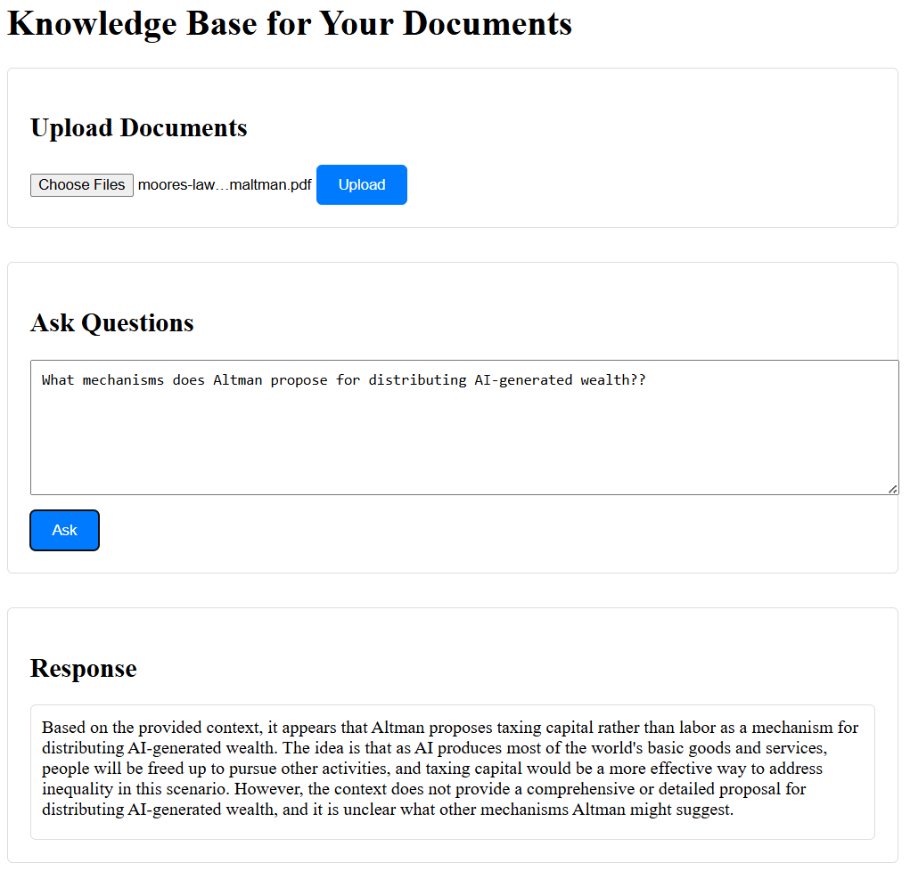

# ask-your-document
RAG | LangChain | Chromadb | S3 | EC2 | Upload your document and ask queries about it!



### STEPS:


### 1. Create a conda environment after cloning the repository

```bash
conda create -n ask-document-cenv python=3.11 -y
```

```bash
conda activate ask-document-cenv
```


### 2. install the requirements
```bash
pip install -r requirements.txt
```


```bash

python app.py
```

Now,
```bash
open up your localhost:8080
```


# AWS-CICD-Deployment-with-Github-Actions

## i. Login to AWS console.

## ii. Create IAM user for deployment

	#with specific access

	1. EC2 access : It is virtual machine

	2. ECR: Elastic Container registry to save your docker image in aws


	#Description: About the deployment

	1. Build docker image of the source code

	2. Push your docker image to ECR

	3. Launch Your EC2 

	4. Pull Your image from ECR in EC2

	5. Lauch your docker image in EC2

	#Policy:

	1. AmazonEC2ContainerRegistryFullAccess

	2. AmazonEC2FullAccess

	
## iii. Create ECR repo to store/save docker image
    - Save the URI: 751792482739.dkr.ecr.us-east-1.amazonaws.com/askbot

	
## iv. Create EC2 machine (Ubuntu) 

## v. Open EC2 and Install docker in EC2 Machine:
	
	
	#optinal

	sudo apt-get update -y

	sudo apt-get upgrade
	
	#required

	curl -fsSL https://get.docker.com -o get-docker.sh

	sudo sh get-docker.sh

	sudo usermod -aG docker ubuntu

	newgrp docker
	
## vi. Configure EC2 as self-hosted runner:
    setting>actions>runner>new self hosted runner> choose os> then run command one by one


## vii. Setup github secrets:

    AWS_ACCESS_KEY_ID=

    AWS_SECRET_ACCESS_KEY=

    AWS_REGION = us-east-1

    AWS_ECR_LOGIN_URI = 751792482739.dkr.ecr.us-east-1.amazonaws.com

    ECR_REPOSITORY_NAME = askbot

    AWS_BUCKET_NAME = 

    GROQ_API_KEY = 
